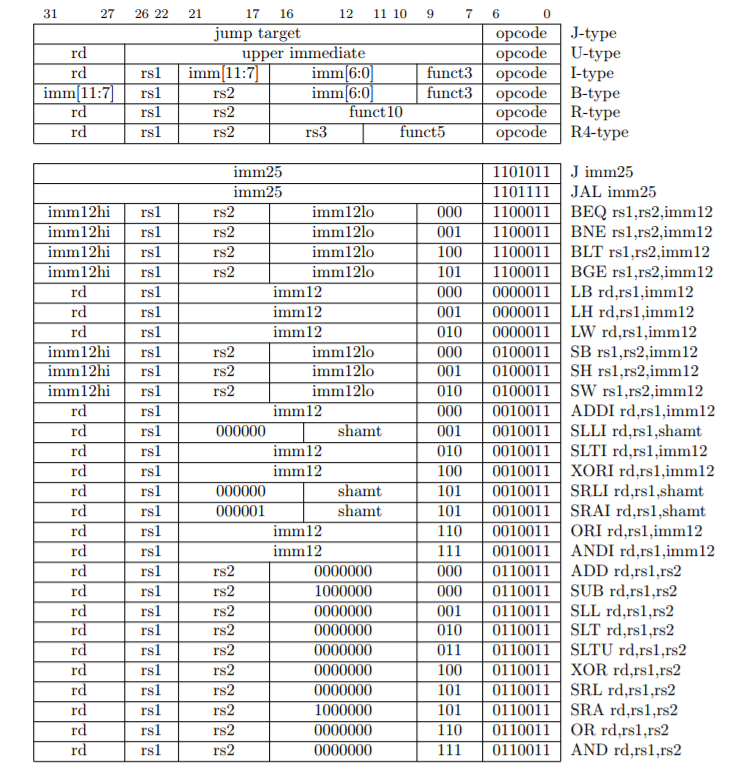
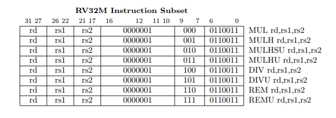

# Rocket Core on Zynq FPGAs

Our team's project this semester was to work in a group of four on testing the Rocket Chip implementation on Zybo boards. The Rocket Chip repository claims to work out-of-the-box on the Zybo and various other FPGAs, but we wanted to see how vlaid this claim was and whether the Zybo supported different configurations of the Rocket Chip. Ultimately, we are looking to improve the performance of machine learning algorithms on the board by testing HW/SW modifications to improve their performance.

This page documents the setup process for building Rocket Cores to work on Zynq FPGAs as well as some of the basic architectural components of a Rocket Core. The installation instructions were tested on a bento/ubuntu-16.04 Vagrant box with 2GB RAM and 2 cores, except where otherwise noted. A Vagrantfile with these configurations has been provided.

Last update: 12/4/17

## Introduction

### Terms and Knowledge
Some terms and background knowledge will be essential to understanding this research project. The pre-requisite knowledge will be explained in the following sections.

#### FPGAs and Zynq-7000
An FPGA is a programmable hardware board. It makes prototyping hardware designs fast, cheap, and simple. At Georgia Tech, an undergraduate computer science student's first exposure to FPGA development might be in CS 3220 - Processor Design, where the student is challenged to implement a simple five stage pipelined processor on an FPGA.

In this research project, we worked with a specific brand and model FPGA board. The Zybo Zynq-7000, distributed by Digilent, is a ready-to-use, entry-level FPGA. It contains a dual-core ARM A9 processor and supports several peripheral components such as Ethernet, video, and audio. Note that the Zybo Zynq-7000 has been replaced by the Zybo Z7-10 as of September 21st, 2017. Purchase information and a feature list can be found here:

<a href="http://store.digilentinc.com/zybo-zynq-7000-arm-fpga-soc-trainer-board/" target="_blank">http://store.digilentinc.com/zybo-zynq-7000-arm-fpga-soc-trainer-board/</a>

The base board only comes with the FPGA itself and does not include any cables, SD cards, or installation materials. To make the most out of this board, it is recommended to also purchase:

<ul>
    <li>x1: USB Cable - 2.0 A Male to Micro B</li>
    <li>x1: microSD card with adapter - Zybo supports 8GB safely, unknown if it supports more. According to <a href="https://www.xilinx.com/support/answers/50991.html" target="_blank">here</a>, it supports an unlimited SD card size. However, booting from larger than 32GB seems to require special configuration according to <a href="https://forums.xilinx.com/t5/Zynq-All-Programmable-SoC/Booting-Zynq-from-a-64GB-SD-Card/td-p/555049" target="_blank">this</a>.</li>
    <li>x1: 5V/2.5A power adapter - coax, center-positive 2.1mm internal-diameter plug. This is desirable if running more complex or powerful designs, such as the Rocket Core and RISC-V Linux used in this research project.</li>
</ul>

Here is a link to the official Zybo reference manual for more information on the Zybo's I/O ports and capabilities:<br>
<a href="https://reference.digilentinc.com/_media/zybo:zybo_rm.pdf" target="_blank">Zynq-7000 Zybo Reference Manual</a>

### ISAs and RISC-V
ISA is an acronym for Instruction Set Architecture. An ISA is a specification for a machine / assembly language. It defines the types of instructions available on a computer, such as ALU operations, types of branches, and memory operations. The implementation of an ISA is independent from the design of the ISA. This means that implementations can vary from vendor to vendor so long as the final circuit satisfies the requirements of the ISA. As an example, x86 is an ISA that both Intel and AMD have implemented on their CPUs to varying successes.

RISC-V (pronounced “risk-five”) is a new ISA designed to support computer architecture research and education. It was developed by the Berkeley Architecture Group (now part of the ASPIRE Lab). RISC-V is a free, open ISA, and is the fifth RISC instruction set that has been developed at Berkeley. The base ISA was designed to be clean, simple, and suitable for direct hardware implementation. More information can be found <a href="https://riscv.org/" target="_blank">here</a> on RISCV's official website.

The base instructions of the RISC-V ISA are similar to those of other RISC instruction sets, such as MIPS or OpenRISC. For a quick overview of the ISA instructions, page 2 of <a href="http://www-inst.eecs.berkeley.edu/~cs250/fa13/handouts/lab2-riscv.pdf" target="_blank">http://www-inst.eecs.berkeley.edu/~cs250/fa13/handouts/lab2-riscv.pdf</a> has been reproduced here.




## Chisel Framework

Chisel is an open-source hardware construction language developed at UC Berkeley that supports advanced hardware design using highly parameterized generators. It allows users to design hardware in a higher-level programming language, Scala, instead of directly interfacing with Verilog.

<a href="https://github.com/ucb-bar/chisel-tutorial/wiki" target="_blank">Here</a> is a succinct yet informative Wiki-Book containing information on the most important features of Chisel. Chisel can be set up from scratch on a Unix based system using the following commands. These commands are just a compiled version of all the installation processes found on various tutorials for how to install Java, Scala, and Chisel.

### Installing Chisel
1. Chisel is a hardware construction language built in Scala. Scala requires the JVM to run, so first install the Java 8 SDK.
```
sudo add-apt-repository ppa:webupd8team/java
sudo apt-get update
sudo apt-get -y install oracle-java8-installer
```

2. Install Scala.
```
echo "deb https://dl.bintray.com/sbt/debian /" | sudo tee -a /etc/apt/sources.list.d/sbt.list
sudo apt-key adv --keyserver hkp://keyserver.ubuntu.com:80 --recv 2EE0EA64E40A89B84B2DF73499E82A75642AC823
sudo apt-get update
sudo apt-get install sbt
```

3. Install necessary build tools. Many of these are necessary for installing riscv-tools later, so be sure to install all of them.
```
sudo apt-get install git make g++ autoconf automake autotools-dev curl device-tree-compiler
sudo apt-get install libmpc-dev libmpfr-dev libgmp-dev gawk build-essential bison flex texinfo
sudo apt-get install gperf libtool patchutils bc zlib1g-dev pkg-config libusb-1.0-0-dev
```

4. Download Chisel (and RISCV) dependencies.
```
git clone http://git.veripool.org/git/verilator
cd verilator
git pull
git checkout verilator_3_886
unset VERILATOR_ROOT
autoconf
./configure
make
sudo make install
cd ..
```

### Chisel Tutorial
Once you have installed Chisel, you can check that it works properly by downloading the Chisel Tutorial and running a basic test.
Interested users can learn the basics of Chisel (and Scala) in a small tutorial developed by Berkeley here:
<a href="https://github.com/ucb-bar/chisel-tutorial" target="_blank">https://github.com/ucb-bar/chisel-tutorial</a>

1. Download and Set-Up Chisel Tutorial
```
git clone https://github.com/ucb-bar/chisel-tutorial.git
cd chisel-tutorial
git fetch origin
git checkout release
sbt run
```

2. Test Chisel Tutorial Setup. If everything installed properly, this should print "Tutorials passing: 1".
```
sbt
> test:run-main problems.Launcher Mux2
```

### Rocket Chip Generator
Originally developed by the Berkeley Architecture Research group (UCBAR), the Rocket Chip Generator creates instances of the RISC-V architecture in Verilog. Written using Chisel, the Rocket Chip Generator can be quickly parameterized to build different configurations of RISC-V hardware. The Rocket Chip open-source repository contains all the necessary tools to build and run the chip and can be found here: <a href="https://github.com/freechipsproject/rocket-chip" target="_blank">https://github.com/freechipsproject/rocket-chip</a>.

Here are the steps to download and set-up the Rocket Chip Generator. Before running this, please make sure you have installed all the Scala and Chisel dependencies as shown in the previous section. Without them, running `build.sh` will fail and you will have to re-do these steps. Note that the recursive submodule update and the build script will take a while, so be prepared to grab a coffee in the meantime.

1. Recursively Download Rocket Chip Submodules
```
git clone https://github.com/ucb-bar/rocket-chip.git
cd rocket-chip
git submodule update --init
cd riscv-tools
git submodule update --init --recursive
```

2. Set up RISC-V environment variables and dependencies.
```
mkdir riscv-built-toolchain
mv riscv-tools riscv-built-toolchain
cd riscv-built-toolchain
export TOP=$(pwd)
export RISCV=$TOP/riscv
export PATH=$PATH:$RISCV/bin
export MAKEFLAGS="$MAKEFLAGS -j2" # Assuming you have 2 cores on your host system
cd riscv-tools
./build.sh
cd $TOP
echo -e '#include <stdio.h>\n int main(void) { printf("Hello world!\\n"); return 0; }' > hello.c
riscv64-unknown-elf-gcc -o hello hello.c
spike pk hello
```

If all went well, your screen should print "Hello world!". For additional debugging help, you may want to consult the riscv-tools GitHub README <a href="https://github.com/riscv/riscv-tools/tree/aca8ec71a3ad9adfc988bdf75306ffe70cbc12e5" target="_blank">here</a>.

## Rocket Chip Project Structure
Here, we describe the Rocket Chip Generator project structure.

### Rocket Chip Generator Repository Structure
First, we will talk about the build repository of the chip. This repository contains sub-repositories using git submodules to manage all the dependencies required to build the Rocket Chip Generator. Here are the included sumodules.

<ol>
	<li><b>chisel</b> - A version of Chisel is included since the Rocket Chip Generator uses Chisel to convert to Verilog. Chisel is being developed alongside the chip generator so it is packaged with it to ensure both are as updated and on the most bleeding edge of commits as possible.</li>
	<li><b>rocket</b> - Holds the source code for Rocket Core. The Rocket Core gets instantiated within a memory system via the chip generator.</li>
	<li><b>uncore</b> - Implements uncore logic such as cache coherence and interfaces to host machines.</li>
	<li><b>hardfloat</b> - Parameterized IEEE 754-2008 compliant floating-point units. The floating-point units in this repository handle subnormal numbers more efficiently in the processor.</li>
	<li><b>dramsim2</b> - Emulates DRAM timing.</li>
	<li><b>fpga-zynq</b> - A version of the FPGA infrastructure that works with the RTL committed in the rocket-chip repository.</li>
	<li><b>riscv-tools</b> - A version of riscv-tools that works with the RTL committed in the rocket-chip repository.</li>
</ol>

### Rocket Chip on Zynq FPGAs
This section is dedicated to learning how to run and configure Rocket Chips on the given Zybo FPGA. The information here is all taken from the following README:

<a href="https://github.com/ucb-bar/fpga-zynq/blob/master/README.md" target="_blank">https://github.com/ucb-bar/fpga-zynq/blob/master/README.md</a>

#### System Stack
The goal is to run a RISC-V binary on a Rocket Core instantiated on the Zybo FPGA. This is accomplished with multiple layers of abstraction. Here, we explain each layer and how it will run on the FPGA starting from the top down.

<ol>
	<li><b>Target Application</b><br>
	 We want to run a user-level application on the FPGA. This application could be something as simple as "Hello World", but will be significant because it will be compiled into RISC-V instructions by a tool such as riscv-gcc. The binary will run on top of an operating system.
	</li>
	<li><b>RISC-V Kernel</b><br>
	The user application will need to run on an operating system compiled for RISC-V. For this purpose, RISC-V Linux and proxy kernel were developed. The proxy kernel is an extremely lightweight kernel designed to be used with a single binary linked against Newlib (not libc).  RISC-V Linux handles almost everything else.
	</li>
	<li><b>Rocket Chip</b><br>
    The Rocket Chip consists of a Rocket Core with L1 instruction and data caches. The compiled Rocket Chip design will be mapped onto the FPGA so that the FPGA emulates a hardware chip that runs RISC-V instructions. RISC-V Linux will run on top of this Rocket Chip. The Rocket Chip will communicate to the ARM core on the FPGA via an interconnect known as AXI.
	</li>
	<li><b>Front-end Server</b><br>
    The front-end server, riscv-fesvr, is an application that resides in the OS running on the ARM core of the FPGA. It provides an interface for the ARM core to the Rocket Chip running on the FPGA.
	</li>
	<li><b>Zynq ARM Core</b><br>
	A dual Cortex A9 core on the FPGA that runs a specialized Linux (PetaLinux) that simplifies interfacing with the FPGA board's components.
	</li>
	<li><b>FPGA Board</b><br>
    The FPGA Board contains the FPGA and several I/O devices. When the board is turned on, the contents of the SD card are used to configure the FPGA and boot Linux on the ARM core.
	</li>
	<li><b>Development System</b><br>
    The development system is a PC with an SD card reader. We develop a number of applications on the development system and each of them will get transferred to the FPGA for different purposes.<br><br>

    Second, we also need to transfer the Rocket Core Verilog design on the SD card so that the FPGA can actually run the RISC-V ISA. We can tell the FPGA to run the Rocket Core design by interfacing with the ARM core over USB or SSH. After connecting to the ARM core, we would just run riscv-fesvr with the RISC-V design as an argument.<br><br>

    Finally, we also need to transfer RISC-V Linux and the user application to begin running on the FPGA's Rocket Core. Once the hardware design for Rocket Core is loaded onto the FPGA, it will begin running RISC-V Linux - a Linux distribution compiled entirely in RISC-V. This distribution can then run executable binaries compiled for RISC-V as well.
	</li>
</ol>

### RISC-V Binaries on Pre-Built Images for ARM Core
UC Berkeley provides several pre-built binaries in its fpga-zynq repository so that users can quickly run RISC-V binaries on the FPGA. Some terms to know:  The Xilinx SDK is a software suite that contains toolchains to compile binaries in formats that the Zybo's CPU will understand. Vivado is an IDE for writing hardware designs, compiling binaries for the ARM core, and transferring designs to the FPGA. The binaries provided are as follows:

<ul>
    <li><b>boot.bin</b> - This is generated by the Xilinx SDK from Vivado and contains three files.</li>

    - A bitstream (rocketchip\_wrapper.bit) which configures the FPGA with the Rocket Chip design. This is the Rocket Chip itself that will be run on the FPGA. We will later see how to create our own bitstreams so we can create different configurations of Rocket Chips.

    - A first stage bootloader (FSBL.elf). This bootloader configures the Zynq system based on the project's block design, so it is built using the Xilinx SDK as well. After the bootloader is finished, it hands control to u-boot.

    - A second stage bootloader (u-boot.elf) that takes configuration information and prepares the ARM processing system for booting Linux. After u-boot finishes, it hands off execution to the ARM Linux kernel.

    <li><b>ARM Linux (uImage)</b> - The copy of Linux designed to run on the ARM CPU. Within this Linux system, we can run tools like fesvr-zedboard to interact with the RISC-V Rocket Core.</li>

    <li><b>ARM RAMDisk (uramdisk.image.gz)</b> - The RAMDisk mounted by the ARM Linux. It contains the root filesystem.</li>

    <li><b>devicetree.dtb</b> - Contains information about the ARM core's peripherals for Linux.</li>
</ul>

### Generating Pre-Built Binaries and Running on Zybo
```
git clone https://github.com/ucb-bar/fpga-zynq.git
cd fpga-zynq/zybo
make fetch-images
make load-sd SD=path_to_mounted_sdcard
```

Once you have generated the binaries and placed them on the SD card, eject the SD card and insert it into the board. Set the board's boot jumper to the SD and power the board on.

To interface with the board via the USB cable, I downloaded and installed the program <a href="https://ttssh2.osdn.jp/index.html.en" target="_blank">Tera Term</a>. After installing Tera Term, configure it so that its Serial settings match the following. The port may be different but the important value to configure is the Baud rate, which defines the rate at which information may be transferred on the channel.

<p align="center">

</p>

After downloading Tera Term and modifying the settings, plug in the Zybo via the USB cable. Turn the switch on and wait for a minute to let the Linux system boot up. Finally, start Tera Term and create a new serial connection. You should be asked for a login prompt; use the username "root" and password "root". You are now accessing the Linux system running on the ARM core and can use the `fesvr-zynq` program to interact with the Rocket Core. You could even mount the SD card and start running RISC-V Linux by doing the following.

```
mkdir /sdcard
mount /dev/mmcblk0p1 /sdcard
./fesvr-zynq +disk=/sdcard/riscv/root.bin /sdcard/riscv/vmlinux
```

## Rocket Chip Architecture

To begin, we performed some research on the architecture of the RISC-V Rocket Chips. An overview of the Rocket Core architecture can be seen <a href="http://www.lowrisc.org/docs/tagged-memory-v0.1/rocket-core/" target="_blank">here</a> but in the following sections, we will attempt to summmarize our understanding.

## Configuring Rocket Chip Memory
To change the configuration of rocketchip, you first need to change the configuration file and modify/add what configuration you want. The `Configs.scala` file with example configurations can be found at `common/src/main/scala/coreplex/Configs.scala`. There are many parameters that can be figured for both the `icache` and the `dcache` such as `rowBits`, `nSets`, `nWays`, `nTLBEntries`, `nMSHRs`, and `blockBytes`. After changing `Configs.scala`. In order to create your own configuration project, a configuration file needs to be added at `common/src/main/scala`. The Verilog for the project can then be regenerated by calling:

```
make rocket CONFIG_PROJECT=ProjectName CONFIG=ConfigName
```

After that, the build process is normal and all that needs to be called are:

```
make project
make fpga-images-zybo/boot.bin
```

This should create the project, generate the bitstream, and create a new `boot.bin` to copy onto the SD card that can then be inserted onto the board.
